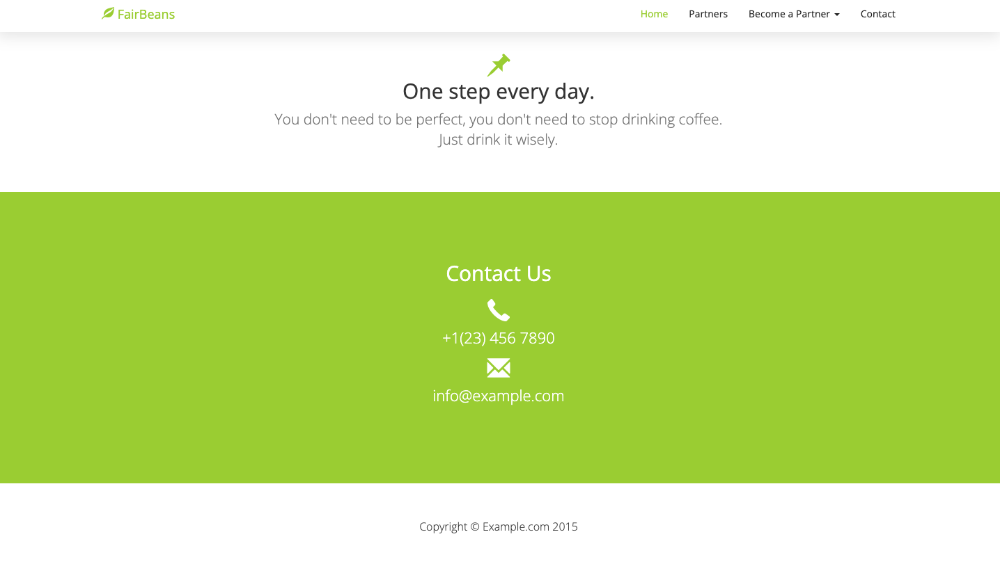

# FairBeans Web Application *[in development]*

### Description:
This is a web application for the fictitious company FairBeans which distributes biological fair trade coffee beans.
The application connects to a database where distribution partners and products are stored. Partners and products are mapped by a many to many relationship.
This project is the base for a new enterprise. The real purpose is hidden to protect the new company until launch.

### Todo:
* Add login for managers and functionality to add products and partners.
* Add login for partners to display their current contract and request changes, etc.
* Display partners in Google Maps plugin.
* improve design and text.
* add unit tests for controller and repository layer

### Technologies used:
* Java 15
* Spring Boot
* JPA & Hibernate
* PostgreSQL
* Maven
* Google Maps: Maps JavaScript API
* bootstrap (used a free template from [quackit.com](https://www.quackit.com/html/templates/))
* thymeleaf

### Demo:

